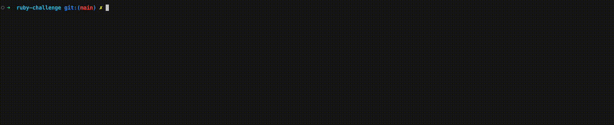

# Bowling Scorer
CLI app that scores games of ten-pin bowling.

It takes a text file as input and outputs the scoring for the associated games to the stdout.

## Installation
This project requires:
- ruby `3.2.2`
- Bundler compatible with version `2.4.10`

To install first clone or download the project to your local machine then run:

```bash
bundle install
``` 

This will install the required gems to run the project.

## Running the project

To run the project you need to run the following command from the project root folder:

```bash 
./bin/bowling-scorer.rb -f <path_to_file>
```

Where `<path_to_file>` is the path to the file containing the bowling scores.

> There are some example files in the `spec/fixtures` folder that you can use to test the project.

If you want more information you can run the following command to get the help menu:

```bash
./bin/bowling-scorer.rb -h
```

The output should be similar to the following:



## Quality Assurance

If you want to run tests and coverage you need to run `bundle config set --local with development` and then `bundle install` first to install the required gems.

### Unit and Integration tests
This project uses Rspec as test suit. To run the tests you need to run the following command:

```bash
bundle exec rspec
```
### Coverage 
Upon running the test you will get a coverage report in the `coverage` folder. You can open the `index.html` file in your browser to see the coverage report.

### Linter
This project uses Rubocop as linter. To run the linter you need to run the following command:

```bash
bundle exec rubocop
```

## Design

This project has a strong domain that provides many informations about the details of the bowling match a InputHandler to parse the input file and arguments and a MatchSerializer that formats the output to be printed.

- `Match`: Represents a bowling match. It has a list of `Games` one for each player;
- `Game`: Represents an entire game for a Player. It has a list of `Frame` and `Roll`;
- `Frame`: Represents a frame in a game. It has a list of `Roll` and provides various public methods on information about the frame like it it's a strike or the cumulative score of it;
  - The Frame references the previous frames on the game sequence and the rolls that impact on the frame score. This allows to calculate the cumulative score of each frame as well as how many pins this frame added individually.
- `Roll`: Represents a player attempt. It provides the attempt character provided on the input and the pins value.
Those classes provide interfaces an default implementations. When implementing a game type you can create your own implementations of those classes to provide the correct behavior for the game type.

To allow extensibility we use `Factory` Pattern to create instances of `Game`, `Frame` and `Roll`.
The most complex factory is the `GameTypeFrameFactory` as it holds the logic to create correct instances of the Frame and needs to validate that the roll sequence provided is valid for the game type.

To make an extension implement the domain interfaces (modules) and create the factories for the new game type. Then you will need to add the `YOUR_GAMEGameFactory` class reference to GameType factories and it will be available to be used via injection with the `-m` argument.

`InputHandler` parses the input from the terminal, read the input file and determine the game type. It then provides input_data and game_type getters to be used. 
  - The parsing of the file is isolated and can be easily replaced by a different implementation if needed and even be decided based on the game type. It was not implemented to be generic as is not required at the moment.

`MatchSerializer` formats the output to be printed. It uses the `Match` to get the information needed to format the output.
  - The formatting of the output is isolated and can be easily replaced by a different implementation if needed and even be decided based on the game type. It was not implemented to be generic as is not required at the moment.

We can extend the `MatchSerializer` to provide other output formats like JSON or XML use the `Match` in other contexts and extend the input handler arguments and parsing capabilities individually without impacting the other parts of the project.